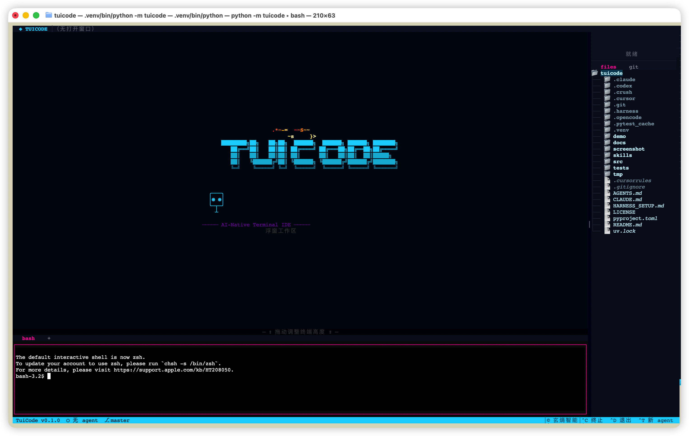
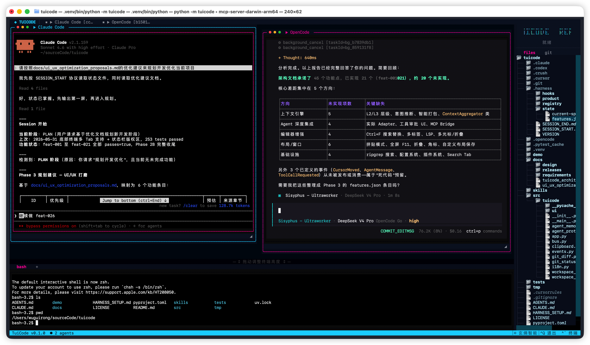

# TuiCode

> A unified TUI workbench designed for terminal AI coding agents

Unite "editor + file manager + multi-terminal + Git + multi-agent sessions + workspace state sync" into a coherent terminal-native experience — letting **humans and multiple AI agents** collaborate in the same terminal environment.

[](https://www.python.org/)
[](https://textual.textualize.io/)
[](LICENSE)

[中文文档](README_CN.md)

---

## Screenshots

**Startup**



**Working interface** — multi-agent sessions · diff preview · file tree



---

## What is TuiCode?

Mainstream IDEs treat AI as a plugin (Copilot sidebar, Cursor panel). TuiCode flips this: **the editor, file tree, and terminal exist to serve the agents — not the other way around**.

TuiCode doesn't take over your agents. It *hosts* mature CLI agents: Claude Code, Codex, Aider, and others continue running their full interactive loops inside PTYs. TuiCode visualizes, syncs, and organizes the project state those agents work on.

| Dimension | Position |
|-----------|----------|
| Form | 100% TUI — runs in any terminal emulator |
| Target users | Developers using CLI agents like Claude Code / Codex / Aider |
| Core value | Unified workbench — no more context-switching between editor, Git tools, and terminals |
| Deployment | Single command, cross-platform (Linux / macOS / WSL) |

**What it is NOT**: Not a VSCode clone, not a terminal emulator, not another AI coding tool, not a window manager.

---

## Features

- **Hybrid layout**: Work units (editor/agent sessions) float freely; global tools (file tree/Git/terminal) stay fixed in a grid
- **Parallel agents**: Run multiple PTY sessions simultaneously (Claude Code, Codex, Aider, custom commands) without focus conflicts
- **Real-time awareness**: File changes and Git status auto-refresh — no manual reload needed
- **Git workflow**: Built-in diff preview (side-by-side view), per-file stage/unstage, one-click commit
- **File manager**: Create / rename / delete (with confirmation) / copy path — right in the file tree
- **Command palette**: `Ctrl+Shift+P` full-screen command search, replacing unreliable dropdowns
- **Layout presets**: `Ctrl+1` editor mode / `Ctrl+2` dual-agent comparison / `Ctrl+3` debug mode
- **Agent status visibility**: Status bar shows live running-agent count; window titles indicate running / done / waiting-for-input

---

## Quick Start

**Prerequisites**: Python 3.11+

```bash
# Install
pip install tuicode

# Launch in your project directory
cd your-project
tuicode
```

**Common keybindings**:

| Shortcut | Action |
|----------|--------|
| `Ctrl+T` | New agent session (Claude Code / Codex / Aider / custom) |
| `Ctrl+Shift+P` | Command palette |
| `Ctrl+1 / 2 / 3` | Switch layout preset |
| `Alt+1 / 2 / 3` | Quick-focus floating windows |
| `Ctrl+\` | Toggle tile / float mode |
| `Ctrl+S` | Save current file |
| `Ctrl+Q` | Quit |

---

## Run from Source

```bash
git clone https://github.com/wuguirong/tuicode.git
cd tuicode
pip install -e ".[dev]"
python -m tuicode
```

Run tests:

```bash
PYTHONPATH=src pytest -q
```

---

## Tech Stack

- **[Textual](https://textual.textualize.io/)** 0.60+ — TUI framework
- **[pyte](https://github.com/selectel/pyte)** — VT220 terminal emulator (PTY output rendering)
- **PTY** — Hosts CLI agents' complete interactive loops

---

## Architecture

See [docs/tuicode_architecture.md](docs/tuicode_architecture.md) for details.

Core design principles:

- **Agents as first-class citizens**: All UI components serve the agents — AI is not demoted to a sidebar plugin
- **Event bus**: The only inter-module communication channel (`FileOpened` / `FileModified` / `GitStatusChanged` / `AgentMessage` etc.)
- **Workspace state aggregator**: Continuously maintains active file, selection, recent file changes, and Git status
- **Protocol-driven**: `AgentAdapter` protocol isolates agent implementation details; the host layer doesn't bind to any specific CLI tool

---

## Contributing

Issues and PRs are welcome. Please read [CONTRIBUTING.md](CONTRIBUTING.md) before submitting.

---

## License

[MIT](LICENSE) © 2026 Shenzhen Xuanshang Intelligence Technology Co., Ltd.
